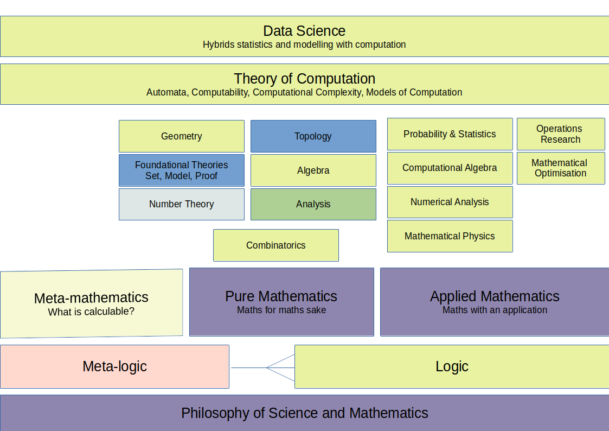

# Introducing Maths

Mathematics is one of a set of studies that its helpful to have an awareness of when studying modern computation:

* Philosophy of Science and Mathematics - the study of meaning and reason.
* Meta-logic - how to construct valid logics.
* Logic - the "systematic study of the valid rules of inference".
* Pure - mathematics without reference to a specific application
* Applied - mathematics in relation to an application e.g. physics
* Meta-mathematics - the study of nature of mathematics itself.
* Theory of Computation

Each of these is a degree subject in and of themselves so we tread lightly, but the wider you read and endulge where your interest takes you the more satisfaction and enjoyment you will get from these studies.

