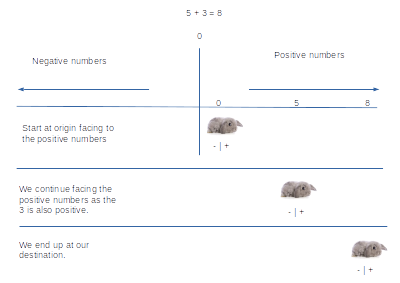
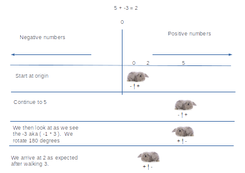
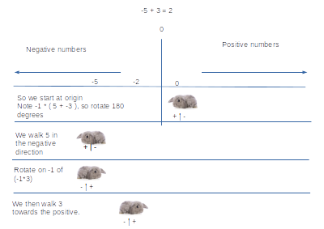
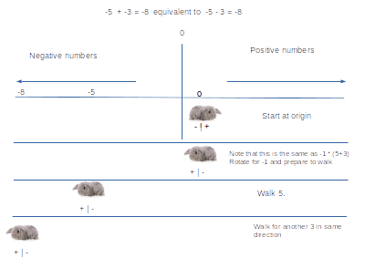
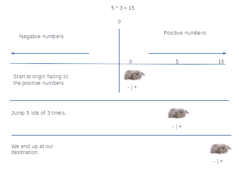
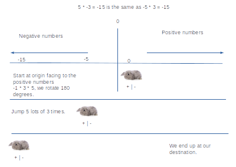
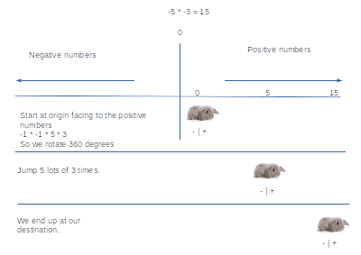

# Why subtraction is a rotation

Later on in maths we learn how different operations are in fact rotations in a 2/3-d space.  It is worth revisiting our notion of the number line and negative numbers to see we can play the same trick in 1 dimension.

In these examples we are a bunny and we are walking along the number line.  Our bunny always walks forward, never backwards.  What the bunny perceives as positive is "forward" as illustrated by the "+|-" underneath.

You can think of our bunny as a point with a direction but no length.  The point has a sense of "positive" relative to itself.  This is equivalent in a 3d game where you have a "world view" transform and a "entity view" transform.

----
Rules of negative numbers:

1. negative number $-n$ is the same as $-1 * n$ 
2. a positive $+$ sign is the same as $-*-$
3. a positive $-$ sign is the same as $+*-$ and $-*+$

4. negative multiplied by a positive is a negative
5. negative multiplied by a negative is a negative

6. negative divided by a positive is a negative
7. negative divided by a negative is a negative
----

### Given a sum such as:

$5 + 3 = 8$

In the image below we start off with our number line and we are facing the positive direction.
We walk 5 and then 3 to arrive at 8.

### Now when we have a sum like:

$5 + -3 = 2$

We start off as usual facing the positive direction. But then we come across -3.  This is -1 * 3.
So we rotate and face the negative direction and then walk 3 backwards.

### What if we start negative?

$-5 + 3 = -2$

First we notice we are starting negative.  This is the same as pulling a -1 out of the left hand side of this equation.  This gives us $-1*(5+-3)$.  The -1 requires us to rotate 180 degrees towards the negative side and then walk 5 in that direction. We then come to -3.  The -1 requires us to rotate 180 degrees again and then walk 3 in the new direction.

### What if both are negative?

-5 + -3 = -8

The first part is the same.  We pull the $-1$ out to give us $-1*(5+3)$.  Our bunny rotates 180 degrees and then walks 5 and then 3 until it gets to -8.

## Multiplication

First remember than division is just multiplication with a negative exponent, so we don't have to worry about that case.

----

Remember that multiplication is commutative so that order of factors does change the result.

$a*b*c*d == b*c*d*a == c*d*a*b == d*a*c*b == etc$

Multiplication is also associative, which means the grouping of the factors does not matter:

$(a*b)*(c*d) == a*(b*c)*d$

----

If both numbers being multiplied are positive, thats easy.  We just go up the positive number line.

If one number is negative, then we have to rotate 180 degrees and head off down the negative side of the number line.

If both are negative, then we rotate 180 degrees twice, which just means we end up going in the same direction.

